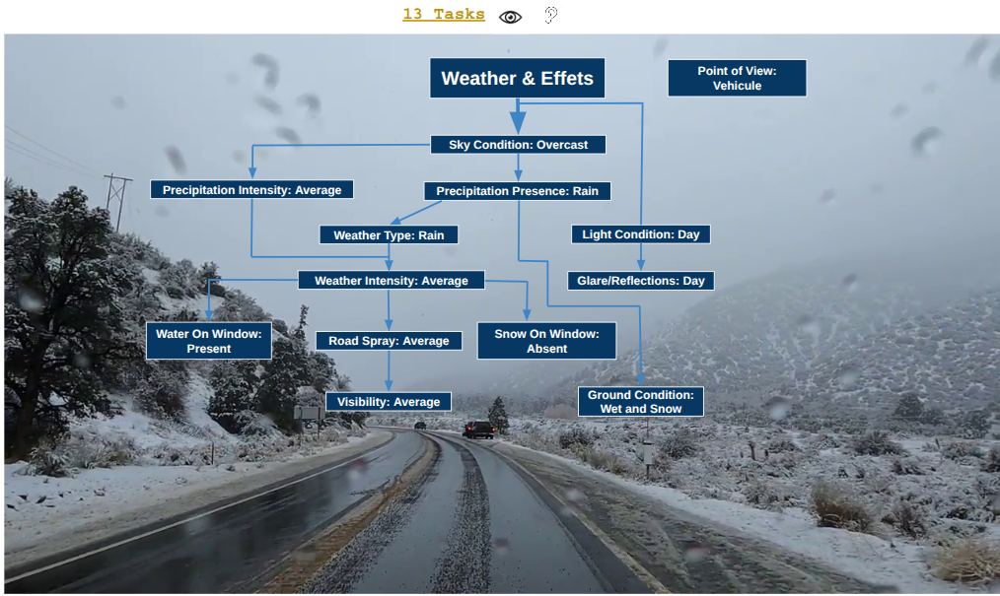
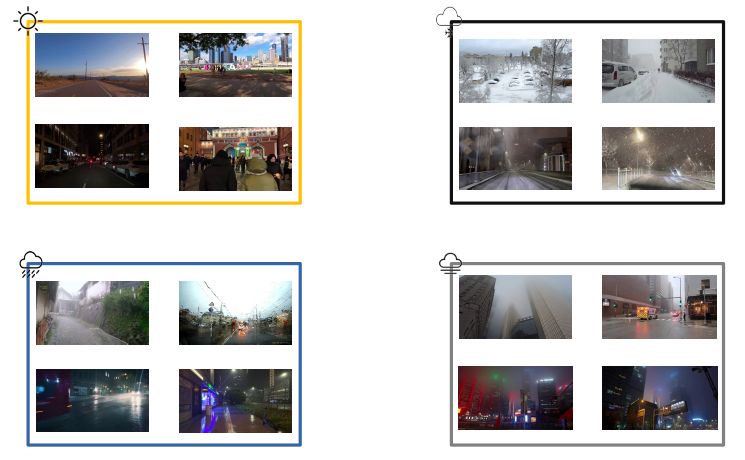
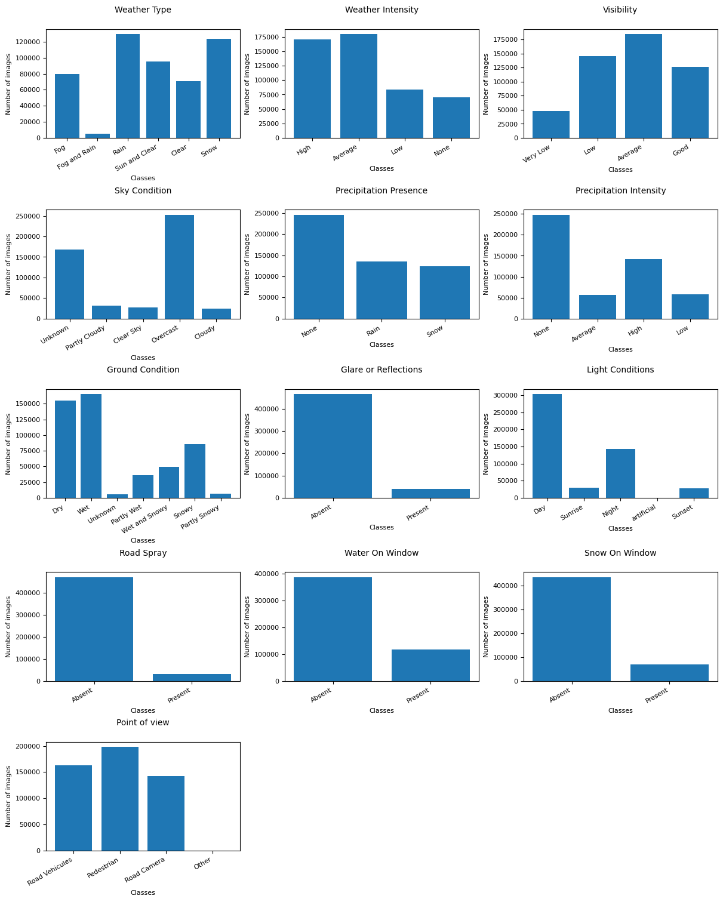
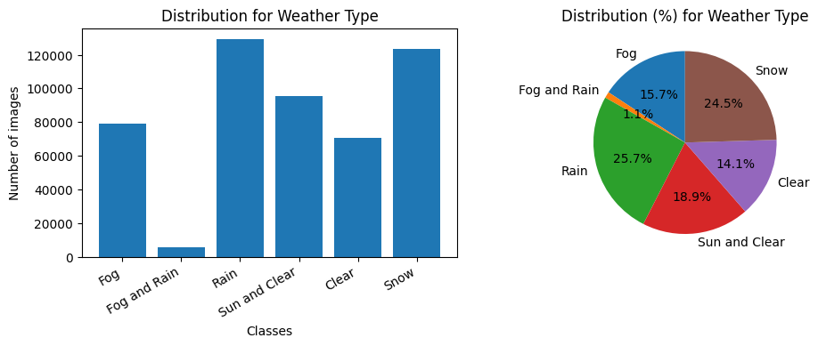
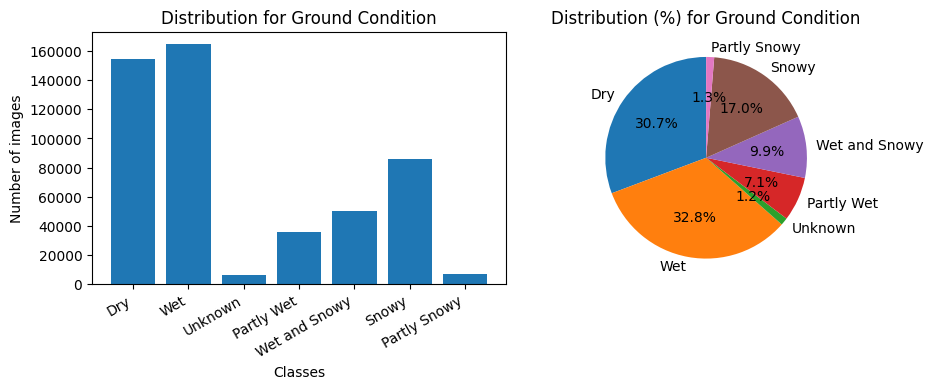
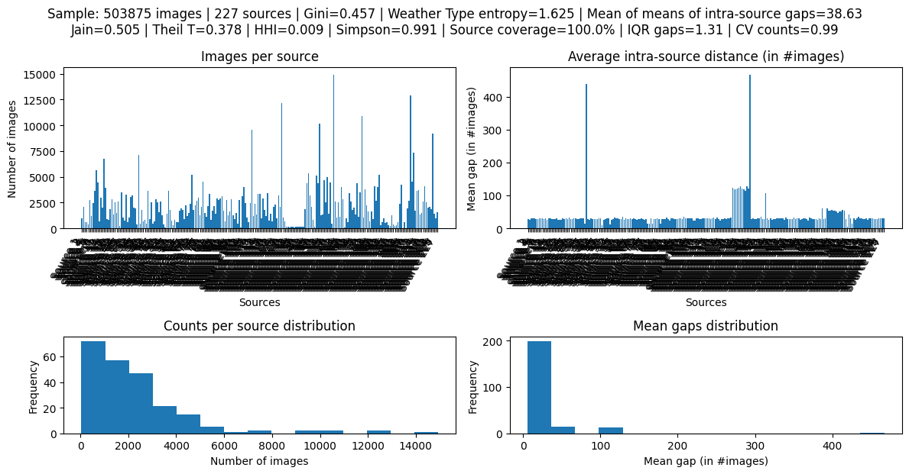
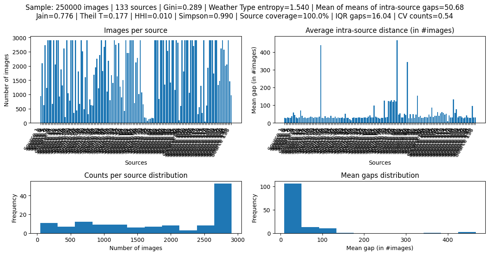
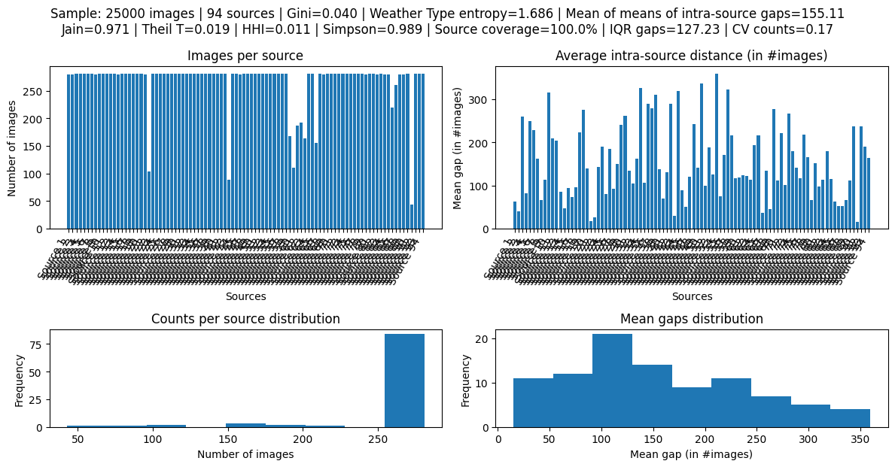

## Dataset

We compile a new dataset of **503,875 RGB images**, released under a **CC-BY license** and available online:  
<https://github.com/Hamedkiri/Weather_MultiTask_Datasets>

Resolutions range from **640×450** to **1280×720**. The images come from public videos under **CC0** or **Open Licence**.

Each image is manually annotated by **three independent annotators** on **13 criteria**, of which **12 concern weather(53 classes)** and **1 concerns the *viewpoint*** (an informative criterion not used for training, intended to diversify the dataset by perspective).

The 13 criteria are:

- **Weather Type**  
  `Clear, Sunny+Clear, Rain, Snow, Fog, Fog+Rain, Fog+Snow, None`

- **Weather Intensity**  
  `Low, Medium, High, None`

- **Visibility**  
  `Very Low, Low, Medium, Good`

- **Sky Condition**  
  `Unknown, Clear Sky, Partly Cloudy, Cloudy, Overcast, Partly Overcast`

- **Precipitation Presence**  
  `None, Rain, Snow, Hail`

- **Precipitation Intensity**  
  `None, Low, Medium, High`

- **Ground Condition**  
  `Dry, Wet, Partly Wet, Snowy, Partly Snowy, Wet+Snowy, Unknown`

- **Glare / Reflections**  
  `Absent, Present`

- **Light Conditions**  
  `Day, Night, Sunset, Sunrise, Artificial Light`

- **Water Spray (road spray)**  
  `Absent, Present`

- **Water on Windshield**  
  `Absent, Present, None`

- **Snow on Windshield**  
  `Absent, Present, None`

- **Viewpoint** (not used for training)  
  `Onboard Vehicle, Pedestrian, Fixed Road Camera`

---

The figure above summarizes class distributions for all tasks.  
The following figures focus on **Weather Type** and **Ground Condition**:

For tasks with strong imbalance (e.g., *water/snow on windshield*), we apply **adaptive class weighting** during training.

---

## Construction of Training and Test Subsets

Our dataset (503,875 images) comes from **227 royalty-free videos**. Consecutive frames from the same source can be visually similar; we therefore constrain selection to:

1. **Reduce intra-video redundancy**  
2. **Precisely balance the contribution of sources**  
3. **Reproduce the same distribution between `train` and `test` while ensuring no overlap**

### General Principle

- **Source stratification**  
  `train` and `test` draw images from all 227 videos, but remain *disjoint* at the image level.

- **Combined Hamilton quotas**  
  For each split, per-source quotas are determined by the **largest remainders method** (Hare–Niemeyer) and co-apportioned between `train` and `test` so that their distributions match that of the full set *and each other*.  
  This prevents any single source from dominating and guarantees splits that are iso-distributed by source.

- **Controlled random selection**  
  Within each video, selection is random **subject to a minimum frame-index gap** to limit near-duplicate pairs.

### Procedure

Let:

- `V = {v1, ..., v227}` be the set of sources (videos)  
- `n(v)` the number of usable images in source `v`  
- `N = Σ_v n(v)` the total number of images  
- `N_train` and `N_test` the target sizes for the train and test sets

Steps:

1. **Share of each source**  
   `s(v) = n(v) / N`

2. **Ideal quotas**  
   - `q_train*(v) = s(v) · N_train`  
   - `q_test*(v)  = s(v) · N_test`

3. **Hamilton (largest remainders) per split**  
   For each of `train` and `test`:
   - First assign `floor(q*)` per source
   - Then distribute the remaining images according to the largest fractional parts until the total reaches exactly `N_train` and `N_test`

4. **Combined apportionment**  
   The remainder lists (train/test) are **interleaved** to minimize per-source divergence between the two splits (shared tie-break), while meeting the target totals.

   This yields quotas `{q_train(v)}` and `{q_test(v)}` such that:

   - `Σ_v q_train(v) = N_train`  
   - `Σ_v q_test(v)  = N_test`  
   - and  
     `q_train(v) / N_train ≈ q_test(v) / N_test ≈ s(v)` for all sources `v`.

5. **Disjoint and spaced sampling**  
   In each source `v`, we draw `q_train(v)` and `q_test(v)` images:
   - with **no overlapping IDs** between `train` and `test`  
   - under the constraint `|f_i - f_j| ≥ Δf_min` (minimum frame index gap) *within* the same split  
   - using a fixed random `seed` for reproducibility

### Sizes and Metrics

We use:

- **Train set**: `250,000` images  
- **Test set**: `25,000` images  

To characterize intra-video redundancy, we measure the **mean frame-index gap**:

`Δf̄ = (1 / |P|) · Σ_(i,j ∈ P) |f_i - f_j|`

over adjacent pairs retained within the same source.

- **Full set (503,875)**  
  - `Δf̄ = 38.63`  
  - See:  
    

- **Train (250k)**  
  - `Δf̄ = 62.75`  
  - Harmonized quotas via Hamilton:  
    

- **Test (25k)**  
  - `Δf̄ = 427.65` (very widely spaced sampling)  
  - See:  
    

### Expected Effects

The combination of **Hamilton apportionment + spacing constraint**:

1. Matches `train`/`test` distributions at the **source level**  
2. Leverages the **full variety across sources** (all videos contribute to both splits)  
3. Reduces **temporal-neighborhood correlations**

The model thus avoids overlearning near-identical patterns from the same sequence, while retaining diversity (day/night, rain/fog/snow, road/urban, etc.).

### Reproducibility

We release:

- Complete annotations  
- Lists of selected image IDs  
- The random seed  
- The apportionment log (Hamilton remainders/assignments)  

All of this is available in the repository:  
<https://github.com/Hamedkiri/Weather_MultiTask_Datasets>

This ensures **reproducible splits** and **no train/test overlap**.
